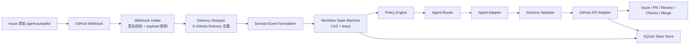
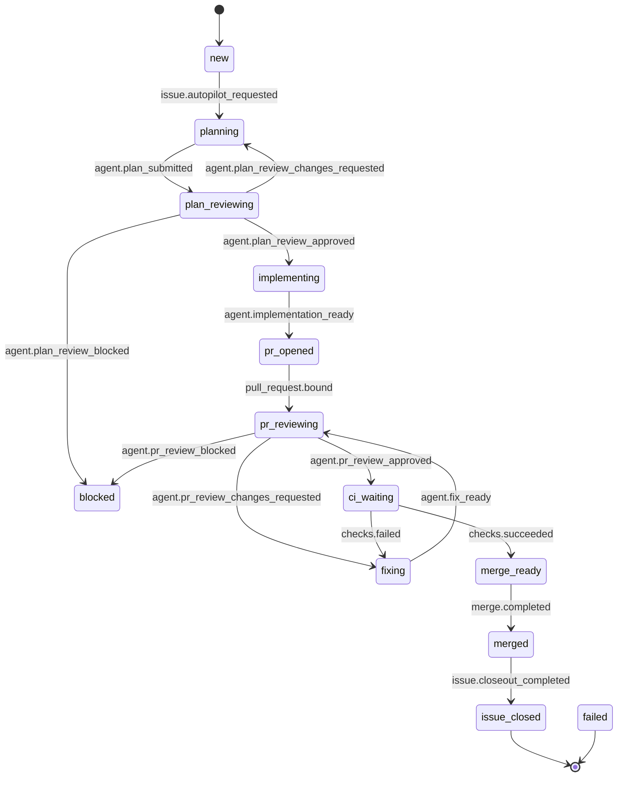

# AgentOrchestrator 工作原理说明

本文面向希望理解系统如何从 GitHub Issue 自动推进到 PR、CI、Merge 和 Issue closeout 的开发者与维护者。系统的核心原则是：GitHub 是用户可见事实来源，SQLite 是本地调度缓存，Agent 只提出建议，所有副作用由 Orchestrator 复核后执行。

配套图示页面：[`workflow-visual.html`](workflow-visual.html)

## 1. 核心角色

| 角色 | 责任 |
| --- | --- |
| GitHub App | 提供 webhook 入口、仓库授权、自动化身份和 GitHub API 权限。 |
| Orchestrator Server | 接收事件、校验签名、去重、推进状态机、执行策略、调度 agent、写回 GitHub。 |
| SQLite State Store | 保存 delivery、workflow run、lease、transition audit 和 idempotent action 记录。 |
| Agent Adapters | 接收经过验证的 task envelope，返回结构化 JSON 结果；不持有 GitHub token。 |
| GitHub API Adapter | 唯一执行 GitHub 写动作的边界，所有写动作必须带 idempotency key 和 request hash。 |
| GitHub Issue / PR | 用户控制台、审计记录和最终可见事实来源。 |

## 2. 总体数据流



关键点：

- Webhook payload 先验签、限流、去重，再进入业务状态机。
- 状态推进不是简单看 label，而是通过 SQLite 的 lease、CAS 和 transition audit 保证并发安全。
- Agent 输出必须通过 JSON schema 和策略复核，不能直接产生 GitHub 副作用。
- GitHub 写动作统一走 adapter，并用 idempotency key 避免重复评论、重复 PR、重复 merge 等副作用。

## 3. 状态机主线



全局控制：

- 任何非终态遇到 `control.pause` 会进入 `paused`。
- 任何非终态遇到 `policy.block` 会进入 `blocked`。
- 自动重试耗尽会进入 `failed`。
- `blocked` 和 `paused` 只能在人工清理阻断条件并触发 resume 后恢复。

## 4. 单次自动处理流程

1. 用户创建 Issue，或给已有 Issue 添加 `agent:autopilot`。
2. GitHub 触发 webhook，Orchestrator 使用 raw body 和 `X-Hub-Signature-256` 做签名校验。
3. Orchestrator 根据 `X-GitHub-Delivery` 记录 delivery；重复 delivery 直接忽略。
4. GitHub 事件被归一化为内部 `DomainEvent`，例如 `issue.autopilot_requested`、`pull_request.synchronized`、`checks.succeeded`。
5. State Store 获取 lease，并用 CAS 检查当前 run、state、head sha 后推进状态。
6. Planner Agent 生成计划，Plan Reviewer Agent 审核计划。
7. Implementer Agent 在受控 workspace 中产出 diff，Orchestrator 用实际 git diff 做 path policy 复核。
8. GitHub API Adapter 创建 branch、commit 和 PR，PR body 包含 plan link、测试、风险、run marker 和 `Closes #<issue>`。
9. PR Reviewer Agent 审核当前 head sha；旧 head 的 review 不可推进 merge gate。
10. CI/check 聚合只读取当前 head sha 的 required checks。
11. Review 或 CI 失败进入 fix loop，直到修复成功或达到最大 fix round。
12. Merge gate 重新计算 labels、risk、plan review、PR review、checks、GitHub mergeable 和 current head。
13. 通过 gate 后调用 GitHub Merge API，并传入当前 head sha。
14. merge 成功后删除 agent branch，写 final summary comment，关闭 Issue。

## 5. 安全和一致性约束

### GitHub 是可见事实来源

Issue、PR、comment、review、check、label 和 merge 结果是用户看到的最终事实。SQLite 只保存调度状态、幂等记录和恢复线索，不是独立任务系统。

### Agent 输出不被直接信任

Agent 只能返回结构化建议，例如 plan、review verdict、implementation result。Orchestrator 会重新验证：

- JSON schema 是否匹配；
- 当前 run、state、head sha 是否仍然有效；
- changed files 是否来自实际 git diff；
- path policy 是否允许；
- required checks 是否属于当前 head；
- merge gate 是否满足 GitHub 约束。

### 所有写动作必须幂等

每个 GitHub 写动作都有：

- `idempotency_key`：描述 run、state、head 和动作；
- `request_hash`：描述本次写请求内容；
- `response_ref`：记录 GitHub 返回的 comment、PR、review、commit、merge sha 等引用。

同 key 同 hash 会跳过或复用结果；同 key 不同 hash 会进入 `IDEMPOTENCY_CONFLICT`。

### Head SHA 绑定

PR review、CI/check 和 merge-ready 结论都只对某个 PR head sha 有效。`pull_request.synchronize` 如果发现 head 变化，会清除旧 review / CI / merge-ready 结论，并回到 `pr_reviewing`。

## 6. 恢复和对账

Reconciliation 负责在 webhook 丢失、进程重启、lease 过期或已有 GitHub artifact 存在时修复本地状态。

它会扫描：

- 带 `agent:autopilot` 且未终止的 Issue；
- 分支名匹配 `agent/issue-*` 的 PR；
- 过期 lease；
- 已有 marker、branch、PR、review、check 和 merge 结果。

Reconciliation 只会在重新读取 GitHub 事实后绑定已有 artifact，不会绕过 `agent:pause`、`agent:no-merge`、`needs-human` 或 policy block。

## 7. 模块与代码位置

| 模块 | 代码 |
| --- | --- |
| Webhook 签名校验 | `src/webhooks/signature.ts` |
| Delivery 去重 | `src/webhooks/delivery-deduper.ts` |
| Domain event 归一化 | `src/webhooks/domain-event.ts` |
| SQLite 状态与幂等 | `src/state/sqlite-store.ts` |
| 状态机和 label 同步 | `src/state/state-machine.ts`, `src/state/labels.ts` |
| Agent adapter 和 fake adapter | `src/agents/adapter.ts`, `src/agents/fake-agent-adapter.ts` |
| Contract validation | `src/contracts/validation.ts` |
| Workspace / diff | `src/workspace/manager.ts` |
| Path policy | `src/policy/path-policy.ts` |
| PR / CI gate | `src/orchestrator/pr-gate.ts` |
| Merge gate / closeout | `src/orchestrator/merge-gate.ts`, `src/orchestrator/closeout.ts` |
| GitHub API adapter contract | `src/github/api.ts`, `src/github/fake-github-api.ts` |

## 8. 验证方式

项目当前使用 Node 内置 test runner 和本地脚本完成验证：

```bash
npm run check
```

该命令会执行：

- `npm run schema:check`：解析所有 JSON schema；
- `npm run format:check`：检查文本文件尾随空白和末尾换行；
- `npm test`：运行 webhook、state store、state machine、agent、policy、PR gate、merge closeout 等测试。

